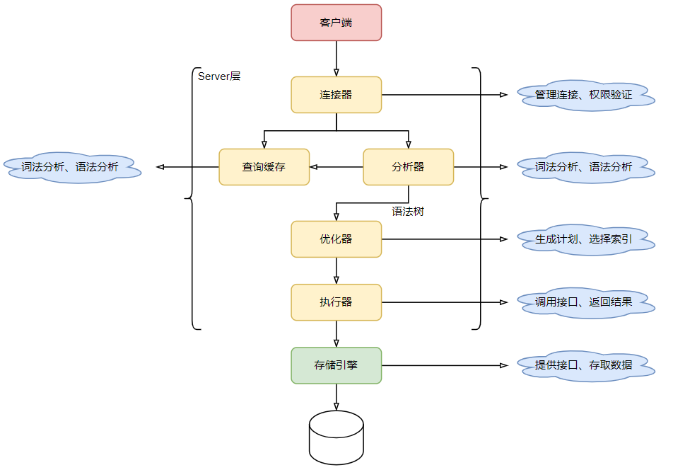
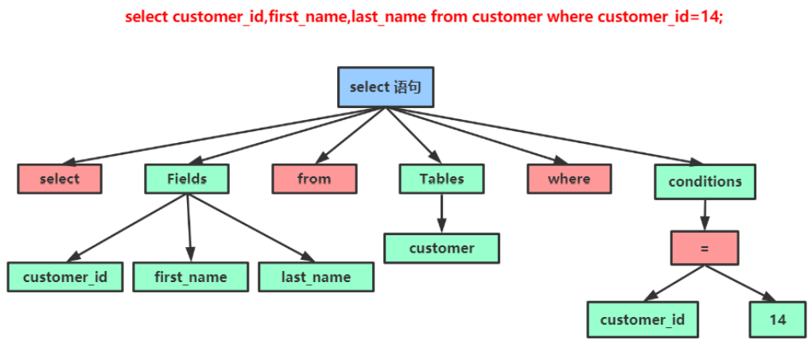
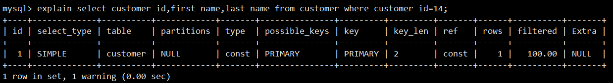
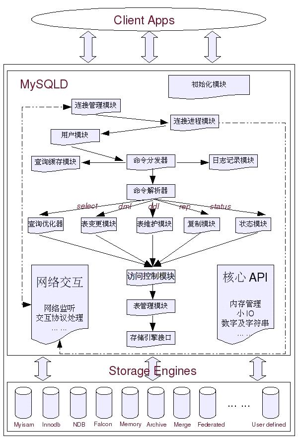

# MySQL逻辑架构

## 1. MySQL逻辑架构图

<left></left>

### 1.1 Connectors

连接器，指不同语言与SQL的交互。

### 1.2 Enterprise Management Services & Utilities

系统管理和控制工具。

### 1.3 Connection Pool（连接池）

- 管理用户连接，等待处理连接请求。
- 负责监听对MySQL Server的各种请求，接收连接请求并将连接请求转发到线程管理模块。系统会为每一个连接上MySQL Server的客户端请求分配（或创建）一个连接线程为其单独服务。
- 连接线程的主要工作就是负责MySQL Server与客户端的通信，接受客户端的命令请求，传递Server端的结果信息等。线程管理模块则负责管理和维护这些连接线程，包括线程的创建、缓存等。

### 1.4 SQL Interface（SQL接口）

接受用户的SQL命令，并且返回结果。

### 1.5 Parser（解析器）

解析器用于对SQL命令进行验证和解析。

- 将SQL语句进行词法分析和语法分析，解析成语法树，并按照不同的操作类型进行分类，然后针对性的转发到后续步骤。
- 如果在分解过程中遇到错误，则说明该SQL语句不合理。

### 1.6 Optimizer（查询优化器）

查询优化器会在SQL语句执行之前先对其进行优化，使用explain语句查看的SQL语句执行计划，就是由查询优化器生成的。

### 1.7 Caches & Buffers（缓存）

缓存的主要作用是将客户端提交给MySQL的查询请求的结果集缓存到内存中，并且与根据查询语句所生成的Hash值相关联。在该查询语句所查询的基表发生任何数据的变化之后，MySQL会自动是该查询语句的缓存失效。在读写比例非常高的应用系统中，缓存对性能的提升非常显著，但它对内容的消耗也非常大。

如果在查询时命中了缓存，就可以直接从缓存中取数据。这个缓存机制是由一系列的小缓存组成，比如表缓存、记录缓存、key缓存、权限缓存等。

### 1.8 Pluggable Storage Engines（存储引擎）

在MySQL中提供了多种存储引擎，存储引擎是针对表的，用户可以根据不同的需求为数据表选择不同的存储引擎，也就是在同一数据库中不同的表可以选择不同的存储引擎。用户也可以根据自己的需要编写自己的存储引擎。

存储引擎是如何存储数据、如何为存储的数据建立索引、如何更新或查询数据等技术的实现方法。

## 2. SQL语句执行流程

SQL语句执行流程如下：

<left></left>

大体上，MySQL可以分为 Server层和存储引擎层两部分。

Server层包括连接器、查询缓存、分析器、优化器、执行器等，涵盖MySQL的大多数核心服务功能，以及所有的内置函数（如日期、时间、数学和加密函数等），所有跨存储引擎的功能都在这一层实现， 比如存储过程、触发器、视图等。

存储引擎层负责数据的存储和提取，其采用插件式的架构模式，支持InnoDB、MyISAM、Memory等多个存储引擎。现在最常用的存储引擎是InnoDB，它从MySQL 5.5.5版本开始成为了默认存储引擎。如果在创建表时不指定存储引擎，将默认使用InnoDB，也可以自行指定存储引擎：

```mysql
mysql> creat table tableName()engine=InnoDB/Memory/MyISAM
```

不同存储引擎存取表数据的方式不同，支持的功能也不同，但不同的存储引擎共用一个Server 层。

假设客户端需要进行如下查询：

```mysql
mysql> select customer_id,first_name,last_name from customer where customer_id=14;
```

### 2.1 连接器

首先需要使用客户端连接上数据库服务端，连接命令如下：

```bash
mysql -h$ip -P$port -u$user -p
```

输完命令之后，需要在交互对话里面输入密码，密码也可以直接在命令行中写在 -p 后面， 但这样可能会导致密码泄露，如果是在生产环境，不建议将密码直接写在 -p 后面。

当客户端请求连接服务端后，首先起作用的就是连接器（连接器负责跟客户端建立连接、获取权限、维持和管理连接），在完成TCP握手后，连接器会使用客户端输入的用户名和密码来认证客户端的身份信息。

- 如果用户名或密码不对，客户端会收到一个 "Access denied for user" 的错误，然后客户端程序结束执行。
- 如果用户名和密码认证通过，连接器会到权限表里面查询该用户所拥有的权限。之后对这个连接的权限判断都将依赖于此时读取到的权限。

这就意味着，一个用户成功建立连接后，即使对这个用户的权限做了修改，也不会影响已经存在连接的权限。修改完成后，只有再新建的连接才会使用新的权限设置。

连接完成后，可以查看其连接状态：

```mysql
mysql> show processlist;
+----+------+-----------+-------+---------+------+----------+------------------+
| Id | User | Host      | db    | Command | Time | State    | Info             |
+----+------+-----------+-------+---------+------+----------+------------------+
|  7 | root | localhost | mysql | Query   |    0 | starting | show processlist |
+----+------+-----------+-------+---------+------+----------+------------------+
```

如果客户端太长时间没有任何操作，连接器会自动将它断开。这个时间是由参数wait_timeout控制，默认为8小时。

```mysql
mysql> show variables like "wait_timeout";
+---------------+-------+
| Variable_name | Value |
+---------------+-------+
| wait_timeout  | 28800 |
+---------------+-------+
```

如果在连接被断开之后，客户端再次发送请求会收到一个错误提醒：“Lost connection to MySQL server during query”，需要重新进行连接才能继续发送请求。

长连接与短连接的区别：数据库里面的长连接是指连接成功后客户端的持续请求会一直使用同一个连接。短连接则是指每次执行完很少的几次查询后就断开连接，下次查询时再重新建立一个连接。

由于建立连接的过程通常比较复杂，所以建议在使用中要尽量减少建立连接的动作，也就是尽量使用长连接。

但是如果全部使用长连接，MySQL可能会出现占用内存增长很快的情况，这是因为MySQL在执行过程中临时使用的内存是管理在连接对象中的，这些资源会在连接断开的时候才释放。所以如果长连接累积下来，就可能导致内存占用太大，被系统强行杀掉（OOM），从现象看就是MySQL异常重启了。

解决这个问题可以考虑使用如下方法：

- 定期断开长连接：在使用一段时间，或者程序里面判断执行过一个占用内存很大的查询后，断开连接然后下次查询时再重连。
- 在MySQL 5.7或更新的版本中，可以在每次执行一个比较大的操作后，通过执行mysql_reset_connection来重新初始化连接资源，这个过程不需要重新连接和权限认证，但是会将连接恢复到刚刚创建完时的状态。

### 2.2 查询缓存

当连接建立完成后，客户端就可以提交查询请求了，当MySQL拿到一个查询请求后，会先到查询缓存中看之前是否已经执行过这条语句，如果已经执行过，则直接将结果返回。在查询缓存中数据是以K-V键值对的形式进行存储的，其中K值为查询语句Hash之后的值，去缓存中查找之前也需要将查询语句先进行Hash。

如果查询语句不在查询缓存中，就会继续后面的执行阶段。执行完成后，执行结果会被存入查询缓存中。

如果查询命中了缓存，其效率是很高的，因为不用执行后面那些复杂的流程。但是大多数情况下不建议使用查询缓存，因为查询缓存的失效可能非常频繁，只要有对一个表的更新，这个表上所有的查询缓存都会被清空。因此很有可能刚把结果存起来就被一个更新全清空了。对于更新压力大的数据库来说，查询缓存的命中率会非常低。除非你的业务就是有一张静态表，很长时间才会更新一次，那这张表上的查询才适合使用查询缓存。

MySQL提供了一种**按需使用**的方式。你可以将参数query_cache_type设置成DEMAND，这样对于默认的SQL语句都不使用查询缓存，而对于确定要使用查询缓存的语句，可以用sql_cache显式指定：

```mysql
mysql> select sql_cache * from user;
```

查看命中缓存的次数：

```mysql
mysql> show status like 'Qcache_hits';
+---------------+-------+
| Variable_name | Value |
+---------------+-------+
| Qcache_hits   | 0     |
+---------------+-------+
```

查看查询缓存是否开启：

```mysql
mysql> show variables like 'query_cache_type';
+------------------+-------+
| Variable_name    | Value |
+------------------+-------+
| query_cache_type | OFF   |
+------------------+-------+
```

query_cache_type参数有如下情况：

- 值为0或者OFF会禁止使用缓存。
- 值为1或ON时会启用缓存，但以SELECT SQL_NO_CACHE开头的语句除外。
- 值为2或DEMAND时，只缓存以SELECT SQL_CACHE开头的语句。

在配置文件中使用query_cache_type配置项配置缓存：

```bash
query_cache_type=2
```

清空查询缓存：

- 清理查询缓存内存碎片：FLUSH QUERY CACHE;
- 从查询缓存中移出所有查询：RESET QUERY CACHE;    
- 关闭所有打开的表，同时清空查询缓存中的内容：FLUSH TABLES;

MySQL 8.0中移除了查询缓存的功能。

### 2.3 分析器

如果查询语句没有命中到缓存，就需要执行该查询语句，MySQL在执行之前得需要知道该查询到底想做什么，也就需要对其进行解析。该部分由MySQL的Parser解析器和Preprocessor预处理模块负责。

客户端程序发送过来的请求事实上只是一段文本，MySQL服务器程序首先需要对这段文本做分析，判断请求的语法是否正确，然后 从文本中将要查询的表、列和各种查询条件都提取出来，其本质上是对一个SQL语句编译的过程，涉及词法解析、语法分析、语义分析等阶段。

词法分析就是把一个完整的SQL语句分割成一个个的字符串，比如：

```mysql
select customer_id,first_name,last_name from customer where customer_id=14;
```

分解后为：

```mysql
select，customer_id,first_name,last_name，from，customer，where，customer_id，
=，14
```

MySQL同时需要识别出这个SQL语句中的字符串分别代表什么。比如MySQL从select关键字识别出这是一个查询语句，把customer识别成表名，把customer_id识别成列。

接下来会进行语法分析，分析器会将词法分析的结果根据语法规则做出语法检查，判断输入的这个SQL语句是否满足MySQL语法。如果查询语句不符合语法规则，就会收到You have an error in your SQL syntax的错误提示。一般语法错误时会提示语句中第一个出现错误的位置，也就是错误提示中紧接use near的内容。

如果语法正确，就会根据MySQL定义的语法规则，根据SQL语句生成一个数据结构，这个数据结构叫做解析树。

<left></left>

预处理器则会进一步检查解析树是否合法，比如表名是否存在，语句中表的列是否存在等等。在这 一步MySQL会检验用户是否有表的操作权限。预处理之后会得到一个新的解析树。

### 2.4 优化器

经过了解析器和预处理器之后就得到了解析树，MySQL知道了这次请求想要做什么。但是一条SQL语句其实可以有多种执行方式，虽然它们最终的返回结果都是相同的。但在这多种执行方式中最终选择哪一种去执行，和其选择的判断标准，都是优化器的作用。

在开始执行SQL之前，要先经过优化器的处理。查询优化器会根据解析树生成不同的执行计划，然后选择一种最优的执行计划，MySQL里面使用的是基于成本模型的优化器，哪种执行计划执行时的成本最小就用哪种，它是io_cost和cpu_cost的开销总和，这通常也是评价一个查询的执行效率的一个常用指标。

查询上次查询的成本开销：

```mysql
mysql> show status like 'Last_query_cost';
+-----------------+----------+
| Variable_name   | Value    |
+-----------------+----------+
| Last_query_cost | 1.199000 |
+-----------------+----------+
```

优化器的优化处理：

- 当有多个索引可用的时候，决定使用哪个索引。
- 在一个语句有多表关联的时候，决定各个表的连接顺序，以哪个表为基准表。

可以使用explain工具查看优化器的执行计划：

<left></left>

优化器不是万能的，不能完全依赖于MySQL的优化器，也不是任何SQL语句都能被优化，MySQL也不是每次都选择到最优的执行计划，在编写SQL语句的时候要注意，要对编写的SQL语句有一个预判，不能将所有的工作都交给MySQL。

### 2.5 执行器

MySQL通过分析器知道了要做什么，通过优化器得到了一个查询计划，知道了该怎么做。接下来就进入了执行器阶段，开始执行语句。

开始执行的时候，要先判断当前用户对这个表是否有相应的权限，如果没有则返回没有权限的错误。在工程实现上，如果命中查询缓存，会在查询缓存返回结果的时候，做权限验证。

如果有权限，就使用指定的存储引擎打开表开始查询。执行器会根据表的引擎定义，去使用这个引擎提供的查询接口提取数据。

比如在上面的例子中，customer_id 字段是主键，执行器的执行流程如下：

- 调用InnoDB引擎接口，从主键索引中检索customer_id=14的记录。
- 主键索引在等值查询后只会查询出一条记录，直接将该记录返回客户端。

假设customer_id字段不是索引，这时查询只能全表扫描。那么执行器的执行流程如下：

-  调用InnoDB引擎接口取该表的第一行，判断customer_id值是不是14，如果不是则跳过，如果是则将这行缓存在结果集中。
-  调用引擎接口取表的下一行，重复相同的判断逻辑，直到取到这个表的最后一行。
- 执行器将上述遍历过程中所有满足条件的行组成的结果集返回给客户端。

### 2.6 详细流程图

<left></left>
