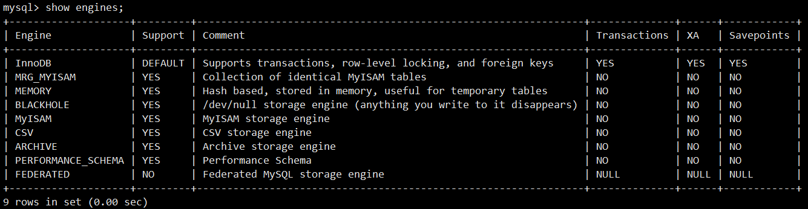
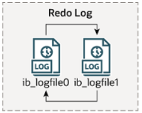
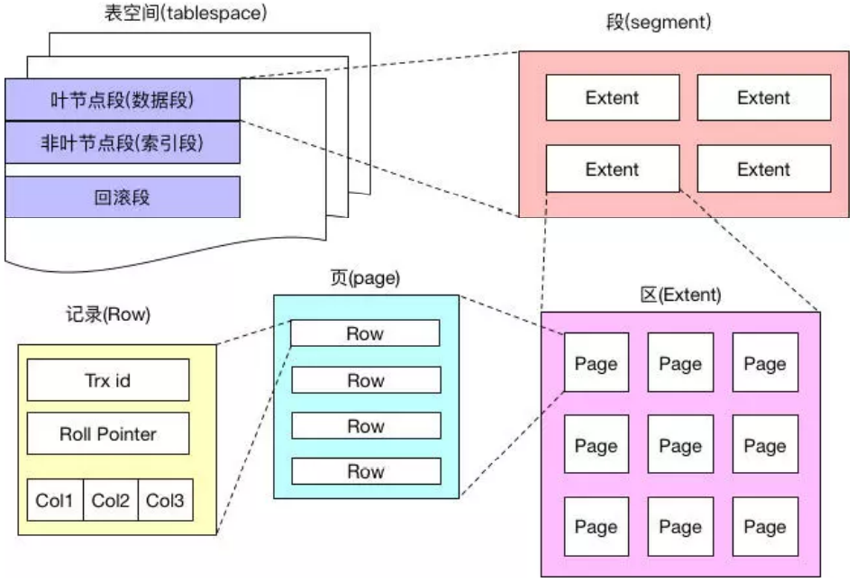
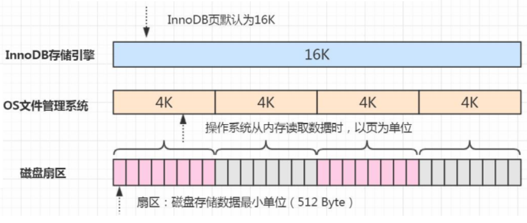
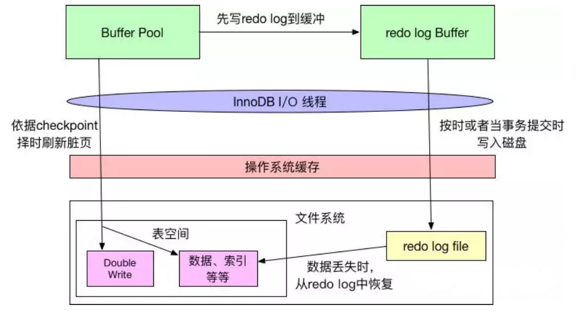
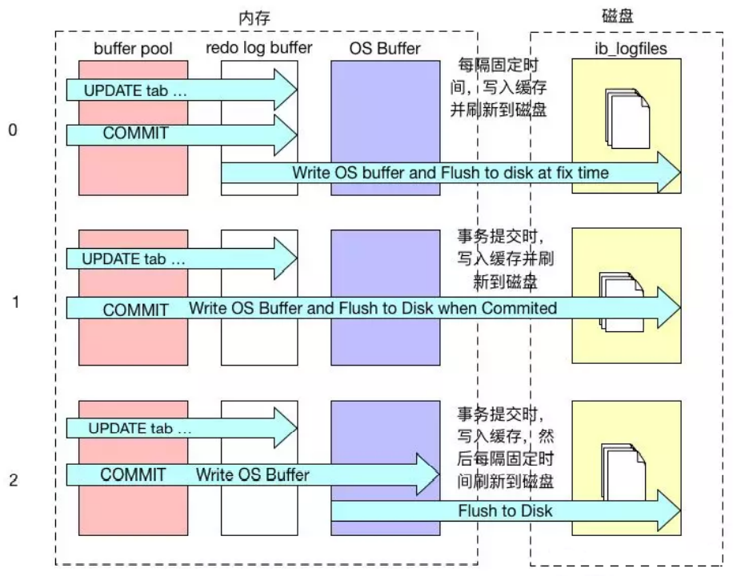
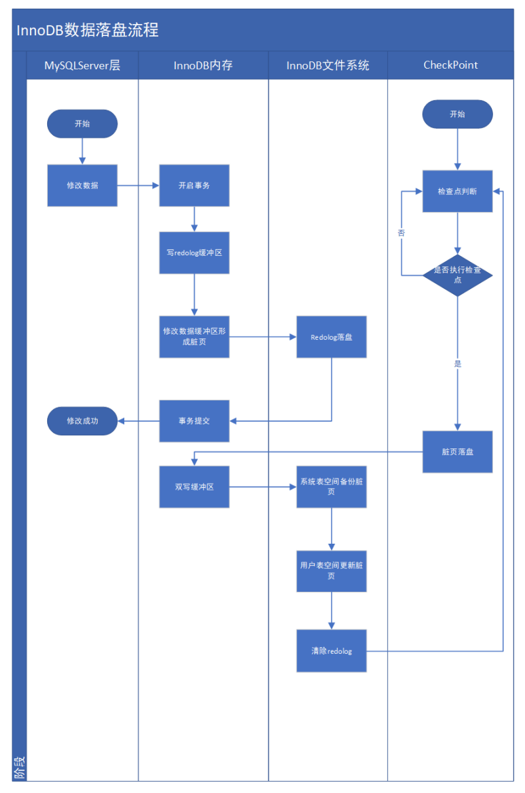

# InnoDB存储引擎

## 1. MySQL存储引擎

MySQL的一些存储引擎介绍：

| 存储引擎 | 说明                                                         |
| -------- | ------------------------------------------------------------ |
| MyISAM   | 高速引擎，拥有较高的插入、查询速度，但不支持事务。           |
| InnoDB   | MySQL 5.5版本后的默认存储引擎，支持事务和行级锁，比MyISAM处理速度稍慢。 |
| ISAM     | MyISAM的前身，MySQL 5.0版本以后不再默认安装。                |
| Merge    | 将多个表联合成一个表使用，在超大规模数据存储时很有用。       |
| Memory   | 内存存储引擎，拥有极高的插入、更新和查询效率，但是会占用和数据量成正比的内存空间。只在内存上保存数据，意味着数据可能会丢失。 |
| Falcon   | 一种新的存储引擎，支持事物处理。                             |
| Archive  | 将数据压缩后进行存储，非常适合存储大量的独立的，作为历史记 录的数据，但是只能进行插入和查询操作。 |
| CSV      | CSV存储引擎基于CSV格式文件存储数据，可应用于跨平台的数据交换。 |

查看存储引擎：

<left></left>

InnoDB和MyISAM存储引擎的区别：

|              | InnoDB                                  | MyISAM                                              |
| ------------ | --------------------------------------- | --------------------------------------------------- |
| 存储文件格式 | .frm 表定义文件<br/>.ibd 数据和索引文件 | .frm 表定义文件<br/>.myd 数据文件<br/>.myi 索引文件 |
| 锁           | 表锁、行锁                              | 表锁                                                |
| 数据操作     | 读和写                                  | 更多的读                                            |
| 计数         | 扫描表                                  | 存储数值                                            |
| 索引结构     | B^+^ Tree                               | B^+^ Tree                                           |

在选择存储引擎时，除非需要用到某些InnoDB不具备的特性，并且没有其他办法可以替代，否则都应该选择InnoDB引擎。

## 2. InnoDB架构图

<left></left>

InnoDB存储引擎由内存池、后台线程和磁盘文件三大部分组成。

## 3. InnoDB磁盘文件

InnoDB的磁盘文件主要分为三大块：系统表空间、用户表空间、redo日志文件和归档文件。

二进制文件（binlog）等文件是MySQL Server层维护的文件，所以未列入InnoDB的磁盘文件中。

### 3.1 重做日志文件

<left></left>

默认情况下，在InnoDB存储引擎的数据目录下会有两个名为ib_logfile0和ib_logfile1的文件，这就是InnoDB的重做日志文件（Redo Log File），它记录了对于InnoDB存储引擎的事务日志。

**重做日志文件的作用是什么？**

- 当InnoDB的数据存储文件发生错误时，重做日志文件就能派上用场。InnoDB存储引擎可以使用重做日志文件将数据恢复为正确状态，以此来保证数据的正确性和完整性。
- 为了得到更高的可靠性，用户可以设置多个镜像日志组，将不同的文件组放在不同的磁盘上，以此来提高重做日志的高可用性。

**重做日志文件组是如何写入数据的？**

每个InnoDB存储引擎至少有一个重做日志文件组（group），每个文件组下至少有两个重做日志文件，比如默认的ib_logfile0和ib_logfile1文件。日志组中每个重做日志文件的大小一致，并以循环写入的方式运行：InnoDB存储引擎先写入第一个重做日志文件，当文件被写满时，会切换到第二个重做日志文件，再当第二个重做日志文件也被写满时，再切换到第一个重做日志文件。

**如何设置重做日志文件大小？**

用户可以使用innodb_log_file_size来设置重做日志文件的大小，这对InnoDB存储引擎的性能有着非常大的影响：如果重做日志文件设置的太大，当数据丢失时其恢复可能需要很长的时间；如果设置的太小，重做日志文件太小会导致依据checkpoint的检查需要频繁刷新脏页到磁盘中，导致性能的抖动。

### 3.2 系统表空间和用户表空间

<left></left>

**系统表空间存储哪些数据？**

系统表空间是一个共享的表空间，它被多个表共享。InnoDB系统表空间包含InnoDB数据字典（元数据以及相关对象）、Doublewrite Buffer、Change Buffer、Undo Logs的存储区域。系统表空间也默认包含任何用户在系统表空间中创建的表数据和索引数据。

**如何配置系统表空间？**

系统表空间由一个或者多个数据文件组成，默认情况下，一个初始大小为10MB，名为ibdata1的系统数据文件在MySQL的data目录下被创建。也可以使用innodb_data_file_path对数据文件的大小和数量进行配置：

```bash
innodb_data_file_path=datafile1[,datafile2]...
```

比如使用`/db/ibdata1`和`/dr2/db/ibdata2`两个文件组成系统表空间：

```bash
innodb_data_file_path=/db/ibdata1:1000M;/dr2/db/ibdata2:1000M:autoextend
```

当这两个文件位于不同的磁盘上时，磁盘的负载可能被平均，因此可以提高数据库的整体性能。两个文件的文件名之后都跟了属性，表示文件ibdata1的大小为1000MB，文件ibdata2的大小为1000MB，而且用完空间之后可以自动增长（autoextend）。

**如何使用用户表空间？**

如果设置了参数innodb_file_per_table，则可以将每个基于InnoDB存储引擎的表产生一个独立的用户表空间，用户表空间的命名规则为`表名.ibd`。通过这种方式，便可以不用将所有数据都存放于默认的系统表空间中。

**用户表空间存储哪些数据？**

用户表空间只存储该表的数据和索引信息，其余信息还是存放在默认的系统表空间中。

### 3.3 InnoDB逻辑存储结构

InnoDB存储引擎逻辑存储结构可分为五级：表空间、段、区、页、行：

<left></left>

**表空间**

从InnoDB存储引擎的逻辑存储结构看，所有数据都被逻辑地存放在一个空间中，称之为表空间 （tablespace）；从功能上来看，InnoDB存储引擎的表空间分为系统表空间，独占表空间，通用表空间，临时表空 间，Undo表空间。

如果开启了独立表空间innodb_file_per_table=1，每张表的数据都会存储到一个独立的表空间中，即一个单独的.ibd文件。

InnoDB存储引擎有一个共享表空间，叫做系统表空间，对应磁盘上的文件ibdata1。如果设置了参数innodb_file_per_table=0关闭了独占表空间，则所有基于InnoDB存储引擎的表数据都会记录到系统表空间。

**段**

表空间由各个段组成，常见的段有数据段、索引段、回滚段等。

在用户表空间中由很多个段组成，创建一个索引时会创建两个段：数据段和索引段。数据段存储着索引树中叶子节点的数据。索引段存储着索引树中非叶子节点的数据。

一个段的空间大小是随着表的大小自动扩展的：表有多大，段就有多大。

一个段至少会有一个区，并且段以区作为最小单位进行扩展。

**区**

一个区由64个连续的页组成，一个区的大小=1M=64个页的大小，每个页的大小为16KB。为了保证区中页的连续性，区在扩展时 InnoDB存储引擎会一次性从磁盘申请4 ~ 5个区。

**页**

InnoDB每个页默认大小是16KB，页是InnoDB管理磁盘的最小单位，也是InnoDB中磁盘和内存交互的最小单位。

查看页的大小：

```mysql
mysql> show global variables like 'innodb_page_size';
+------------------+-------+
| Variable_name    | Value |
+------------------+-------+
| innodb_page_size | 16384 |
+------------------+-------+
```

索引树上一个节点就是一个页，MySQL规定一个页上最少存储2个数据项。如果向一个页插入数据时，而这个页已将满了，此时就会从区中分配一个新页。如果向索引树叶子节点中间的一个页中插入数据，而这个页是满的，此时就会发生页分裂。

操作系统管理磁盘的最小单位也是页，是操作系统读写磁盘的最小单位，Linux中的页一般是4KB。所以InnoDB从磁盘中读取一个数据页时，操作系统会分4次从磁盘文件中读取数据到内存。写入时也是一样，需要分4次从内存写入到磁盘中。

<left></left>

**行**

InnoDB的数据是以行为单位存储的，一个页中包含多个行。在MySQL 5.7中，InnoDB提供了4种行格式：Compact、Redundant、Dynamic和Compressed，其中Dynamic为MySQL 5.7默认的行格式。

创建表时可以指定行格式：

```mysql
CREATE TABLE T (C INT) ROW_FORMAT=DYNAMIC;
```

修改表的行格式：

```mysql
ALTER TABLE T ROW_FORMAT=Compact|Redundant|Dynamic|Compressed;
```

查看默认行格式：

```mysql
mysql> show variables like 'innodb_default_row_format';
+---------------------------+---------+
| Variable_name             | Value   |
+---------------------------+---------+
| innodb_default_row_format | dynamic |
+---------------------------+---------+
```

修改默认的行格式：

```mysql
SET GLOBAL innodb_default_row_format=DYNAMIC;
```

查看某个表的行格式：

```mysql
mysql> SHOW TABLE STATUS LIKE 'customer'\G;
*************************** 1. row ***************************
           Name: customer
         Engine: InnoDB
        Version: 10
     Row_format: Dynamic
           Rows: 599
 Avg_row_length: 136
    Data_length: 81920
Max_data_length: 0
   Index_length: 49152
      Data_free: 0
 Auto_increment: 600
    Create_time: 2021-12-12 22:37:10
    Update_time: 2021-12-12 22:38:14
     Check_time: NULL
      Collation: utf8mb4_general_ci
       Checksum: NULL
 Create_options: 
        Comment: 
```

## 4. InnoDB内存结构

<left></left>

### 4.1 缓冲池（Buffer Pool）

InnoDB存储引擎是基于磁盘存储的，并将其中的记录按照页的方式进行管理。但是由于CPU速度和磁盘速度之间的鸿沟，基于磁盘的数据库系统通常使用缓冲池来提高数据库的整体性能。而且缓冲池的大小直接影响着数据库的整体性能，可以通过配置项innodb_buffer_pool_size来设置缓冲池的大小。

缓冲池中缓存的数据页类型有：索引页、数据页、undo页、插入缓冲（insert buffer）、自适应哈希索引（adaptive hash index）、InnoDB存储的锁信息（lock info）和数据字典信息（data dictionary）。

在架构图中，InnoDB存储引擎的内存区域除了有缓冲池之外，还有重做日志缓冲和额外内存池。InnoDB存储引擎首先将重做日志信息放到重做日志缓冲区中，然后按照一定频率将其刷新到重做日志文件中。重做日志缓冲一般不需要设置得很大，该值可由配置参数 innodb_log_buffer_size进行控制。

**数据页和索引页**

InnoDB存储引擎工作时，需要以Page页为最小单位去将磁盘中的数据加载到内存中，与数据库相关的所有内容都存储在Page结构里。Page分为几种类型，数据页和索引页就是其中最为重要的两种类型。

**更新缓冲（插入缓冲）**

更新缓冲主要针对次要索引的数据插入存在的问题而设计。在InnoDB引擎上进行插入操作时，一般需要按照主键顺序进行插入，这样才能获得较高的插入性能。当一张表中存在次要索引时，在插入时其数据页的存放还是按照主键进行顺序存放的，但对于次要索引叶节点的插入不再是顺序的，这时就需要离散的访问次要索引页，由于随机读取的存在导致插入操作性能下降。InnoDB为此设计了Change Buffer来进行插入优化，对于次要索引的插入或者更新操作不是每一次都直接插入到索引页中，而是先判断插入的非主键索引是否在缓冲池中，若存在则直接插入，若不在则先放入到一个Change Buffer中。看似数据库这个非主键的索引已经插到叶节点，但实际没有插入，此时该数据存放在另外一个位置，然后再以一定的频率和情况进行Change Buffer和非聚簇索引页子节点的合并操作，这时通常能够将多个插入合并到一个操作中，这样就大大提高了对于非聚簇索引的插入性能。

**自适应哈希索引**

InnoDB会根据访问的频率和模式，为热点页建立哈希索引，来提高查询效率。

哈希（hash）是一种非常快的查找方法，在一般情况下这种查找的时间复杂度为O(1)，即一般仅需要一次查找就能定位数据。而B^+^树的查找次数取决于B^+^树的高度，在生产环境中B+树的高度一般为3\~4层，故需要3\~4次的查询。

InnoDB存储引擎会监控对表上各索引页的查询。如果观察到建立哈希索引可以带来速度提升，则建立哈希索引，称之为自适应哈希索引（Adaptive Hash Index，AHI）AHI是通过缓冲池的B^+^树页构造而来，因此建立的速度很快，而且不需要对整张表构建哈希索引。 InnoDB存储引擎会自动根据访问的频率和模式来自动地为某些热点页建立哈希索引。

AHI有一个要求，即对这个页的连续访问模式必须是一样的。例如对于（a，b）这样的联合索引页，其访问模式可以是以下情况：

- WHERE a=xxx 
- WHERE a= xxx and b=xxx

访问模式一样指的是査询的条件一样，若交替进行上述两种查询，那么InnoDB存储引擎不会对该页构造AHI，此外AHI还有如下要求:

- 以该模式访问了100次
- 页通过该模式访问了N次，其中N=页中记录*1/16

启用AHI后，读取和写入速度可以得到提升，辅助索引的连接操作性能也可以得到提高。AHI是非常好的优化模式，其设计思想是数据库的自优化（self-tuning），即无需DBA对数据库进行人为调整。

可以通过参数innodb_adaptive_hash_index来禁用或启动此特性，默认是开启状态：

```mysql
mysql> show variables like 'innodb_adaptive_hash_index';
+----------------------------+-------+
| Variable_name              | Value |
+----------------------------+-------+
| innodb_adaptive_hash_index | ON    |
+----------------------------+-------+
```

**锁信息**

InnoDB存储引擎会在行级别上对表数据进行上锁。InnoDB也会在数据库内部其他很多地方使用锁，从而允许对多种不同资源提供并发访问。数据库系统使用锁是为了支持对共享资源进行并发访问，提供数据的完整性和一致性。

**数据字典信息**

InnoDB有自己的表缓存，可以称为表定义缓存或者数据字典（Data Dictionary）。当InnoDB打开一张表，就增加一个对应的对象到数据字典。

数据字典是对数据库中的数据、库对象、表对象等的元信息的集合。MySQL中的数据字典信息内容包括表结构、数据库名、表名、字段的数据类型、视图、索引、表字段信息、存储过程、触发器等内容。MySQL的INFORMATION_SCHEMA库提供了对数据的元数据、统计信息、以及有关MySQL Server的访问信息（例如数据库名或表名，字段的数据类型和访问权限等）。该库中保存的信息也可以称为 MySQL的数据字典。

### 4.2 额外内存池（Addtional memory pool）

额外内存池是InnoDB存储引擎用来存放数据字典信息以及一些内部数据结构的内存空间，可以使用innodb_additional_mem_pool_size参数进行控制。当MySQL实例中的数据库对象非常多的时候，就需要适当调整该参数的大小以确保所有数据都能存放在内存中以提高访问效率。当这个参数设置的值过小的时候，MySQL会记录Warning信息到数据库的error log中，这时候就知道该调整这个参数的大小了。

该参数在MySQL 5.7.4 中移除。

### 4.3 重做日志缓冲（Redo log Buffer）

<left></left>

InnoDB在缓冲池中变更数据时，会首先将相关变更写入重做日志缓冲中，然后再按时或者当事务提交时写入磁盘，这符合Force-log-at-commit原则；当重做日志写入磁盘后，缓冲池中的变更数据才会依据checkpoint机制择时写入到磁盘中，这符合WAL原则。

在checkpoint择时机制中，就有重做日志文件写满的判断，所以如果重做日志文件太小，经常被写满，就会频繁导致checkpoint将更改的数据写入磁盘，导致性能抖动。

操作系统的文件系统是带有缓存的，当InnoDB向磁盘写入数据时，有可能只是写入到了文件系统的缓存中。

InnoDB的innodb_flush_log_at_trx_commit属性可以控制每次事务提交时InnoDB的行为：

- 当属性值为0时，事务提交时不会对重做日志进行写入操作，而是等待主线程按时写入每秒写入 一次。
- 当属性值为1时，事务提交时会将重做日志写入文件系统缓存，并且调用文件系统的fsync，将文件系统缓冲中的数据真正写入磁盘存储，确保不会出现数据丢失。
- 当属性值为2时，事务提交时也会将日志文件写入文件系统缓存，但是不会调用fsync，而是让文件系统自己去判断何时将缓存写入磁盘。

innodb_flush_log_at_trx_commit是InnoDB性能调优的一个基础参数，涉及InnoDB的写入效率和数据安全。当参数值为0时写入效率最高，但是数据安全最低；参数值为1时写入效率最低，但是数据安全最高；参数值为2时，二者都是中等水平。一般建议将该属性值设置为1，以获得较高的数据安全性，而且也只有设置为1，才能保证事务的持久性。

日志的刷盘机制如下图所示：

<left></left>

### 4.4 内存数据落盘

**整体思路分析**

<left></left>

InnoDB内存缓冲池中的数据page要完成持久化，要通过两个流程，一个是脏页落盘，一个是预写redo log日志。

当缓冲池中的页的版本比磁盘要新时，数据库需要将新版本的页从缓冲池刷新到磁盘。但是如果每次一个页发生变化，就进行刷新，那么性能开发是非常大的，于是InnoDB采用了Write Ahead Log（WAL）策略和Force Log at Commit机制实现事务级别下数据的持久性。

WAL要求数据的变更写入到磁盘前，首先必须将内存中的日志写入到磁盘。

Force Log at Commit要求当一个事务提交时，所有产生的日志都必须刷新到磁盘上，如果日志刷新成功后，缓冲池中的数据刷新到磁盘前数据库发生了宕机，那么在重启时数据库可以从日志中恢复数据。

为了确保每次日志都写入到重做日志文件，在每次将重做日志缓冲写入重做日志后，必须调用一次fsync操作，将缓冲文件从文件系统缓存中真正写入磁盘。可以通过innodb_flush_log_at_trx_commit来控制重做日志刷新到磁盘的策略。

**脏页落盘**

在数据库中进行读取操作时会将从磁盘中读到的页放在缓冲池中，下次再读相同的页时首先判断该页是否在缓冲池中。若在缓冲池中，称该页在缓冲池中被命中，直接读取该页，否则读取磁盘上的页。

对于数据库中页的修改操作，首先修改在缓冲池中的页，然后再以一定的频率刷新到磁盘上。 页从缓冲池刷新回磁盘的操作并不是在每次页发生更新时触发，而是通过一种称为CheckPoint的机制刷新回磁盘。

**重做日志落盘**

Log Buffer写入磁盘的时机由参数innodb_flush_log_at_trx_commit控制，默认是1，表示事务提交后立即落盘。

用户程序写入数据到磁盘文件时，需要调用操作系统的接口。操作系统本身具有缓冲区，之后依赖操作系统机制不时的将缓存刷新到磁盘文件中。用户程序可以执行fsync操作将操作系统缓冲区的数据刷入到磁盘文件中。 

innodb_flush_log_at_trx_commit参数情况如下：

- 该值为0时，MySQL每秒一次将数据从log buffer写入日志文件并同时fsync刷新系统缓存到磁盘中。 每次事务提交时，不会立即把log buffer里的数据写入到redo log日志文件中。如果MySQL崩溃或者服务器宕机，此时内存里的数据会全部丢失，最多会丢失1秒的事务。
- 该值为1时，每次事务提交时MySQL将数据将从log buffer写入日志文件并同时fsync刷新到磁盘中。该模式为系统默认，在MySQL崩溃时已经提交的事务不会丢失，要完全符合ACID就必须使用默认设置值1。
- 该值为2时，每次事务提交时MySQL将数据从log buffer写入日志文件，MySQL每秒执行一次fsync操作将数据同步到磁盘中。每次事务提交时，都会将数据刷新到操作系统缓冲区，可以认为已经持久化磁盘，如果MySQL崩溃已经提交的事务不会丢失。但是如果服务器宕机或者意外断电，操作系统缓存内的数据会丢失，但最多丢失1秒的事务。

只有设置为1时是最安全的方式，可以真正地保证事务的持久性，但是由于MySQL执行刷新操作fsync是阻塞的，只有到完成后才会返回，而写磁盘的速度是很慢的，因此MySQL的性能会明显地下降。

0和2的性能最好，综合安全性和性能的考虑，在业务中经常使用的2这种模式，在MySQL异常重启时不会丢失数据，只有在服务器意外宕机时才会丢失1秒的数据，这种情况的几率很低，相对于性能来说，这是可以容忍的。

### 4.5 检查点机制（CheckPoint）

#### 4.5.1 简介

如果重做日志可以无限地增大，同时缓冲池也足够大，那么是不需要将缓冲池中页的新版本刷新回磁盘。因为当发生宕机时，完全可以通过重做日志来恢复整个数据库系统中的数据到宕机发生的时刻。但是这需要两个前提条件：

- 缓冲池可以缓存数据库中所有的数据。
- 重做日志可以无限增大。

Checkpoint（检查点）可以解决以下几个问题：

- 缩短数据库的恢复时间。
- 缓冲池不够用时，将脏页刷新到磁盘。
- 重做日志不可用时，刷新脏页。

具体情况如下：

- 当数据库发生宕机时，数据库不需要重做所有的日志，因为Checkpoint之前的页都已经刷新回磁盘。数据库只需对Checkpoint后的重做日志进行恢复，这样就大大缩短了恢复的时间。

- 当缓冲池不够用时，根据LRU算法会溢出最近最少使用的页，若此页为脏页，那么需要强制执行Checkpoint，将脏页也就是页的新版本刷回磁盘。
- 当重做日志出现不可用时，因为当前事务数据库系统对重做日志的设计都是循环使用，并不是让其无限增大。重做日志可以被重用的部分是指这些重做日志已经不再需要，当数据库发生宕机时，数据库恢复操作不需要这部分的重做日志，因此这部分就可以被覆盖重用。如果重做日志还需要使用，那么必须强制Checkpoint，将缓冲池中的页至少刷新到当前重做日志的位置。

对于InnoDB存储引擎而言，是通过LSN（Log Sequence Number）来标记版本的。LSN是8字节的数字，每个页有LSN，重做日志中也有LSN，Checkpoint也有LSN。

Checkpoint所做的事情无外乎是将缓冲池中的脏页刷回到磁盘，不同之处在于每次刷新多少页到磁盘，每次从哪里取脏页，以及什么时间触发Checkpoint。

#### 4.5.2 Checkpoint分类

在InnoDB存储引擎内部，有两种Checkpoint，分别为：Sharp Checkpoint、Fuzzy Checkpoint。Sharp Checkpoint在关闭数据库的时候，将buffer pool中的脏页全部刷新到磁盘中。Fuzzy Checkpoint是数据库在正常运行的不同的时机将部分脏页写入磁盘，仅刷新部分脏页到磁盘，也是为了避免一次刷新全部的脏页造成的性能问题。

Fuzzy Checkpoint有如下分类：

- Master Thread Checkpoint
- FLUSH_LRU_LIST Checkpoint
- Async/Sync Flush Checkpoint
- Dirty Page too much Checkpoint

**Master Thread Checkpoint**

在Master Thread中，会以每秒或者每10秒一次的频率，将部分脏页从内存中刷新到磁盘，这个过程是异步的。正常的用户线程对数据的操作不会被阻塞。

**FLUSH_LRU_LIST Checkpoint**

FLUSH_LRU_LIST Checkpoint是在单独的page cleaner线程中执行的。MySQL对缓存的管理是通过buffer pool中的LRU列表实现的，LRU空闲列表中要保留一定数量的空闲页面，来保证buffer pool中有足够的空闲页面来相应外界对数据库的请求。当这个空闲页面数量不足的时候，就发生FLUSH_LRU_LIST Checkpoint。

空闲页的数量由innodb_lru_scan_depth参数表来控制，因此在空闲页数量少于配置的值的时候会发生checkpoint，剔除部分LRU列表尾端的页面。

查看innodb_lru_scan_depth的值：

```mysql
mysql> show variables like 'innodb_lru_scan_depth';
+-----------------------+-------+
| Variable_name         | Value |
+-----------------------+-------+
| innodb_lru_scan_depth | 1024  |
+-----------------------+-------+
```

**Async/Sync Flush Checkpoint**

Async/Sync Flush Checkpoint是在单独的page cleaner线程中执行的。Async/Sync Flush Checkpoint发生在重做日志不可用的时候，将buffer pool中的一部分脏页刷新到磁盘中，在脏页写入磁盘之后，事务对应的重做日志也就可以释放了。

对于是执行Async Flush Checkpoint还是Sync Flush Checkpoint，由checkpoint_age以及async_water_mark和sync_water_mark来决定：

```bash
#checkpoint_age等于最新的lsn减去已经刷新到磁盘的lsn的值
checkpoint_age = redo_lsn - checkpoint_lsn
sync_water_mark = 90% * innodb_log_file_size
async_water_mark = 75% * innodb_log_file_size
```

解析如下：

- 当checkpoint_age < async_water_mark时，无需执行Flush Checkpoint，也就说redo
  log剩余空间超过25%的时候无需执行Async/Sync Flush checkpoint。
- 当async_water_mark < checkpoint_age < sync_water_mark的时候，执行Async Flush
  Checkpoint，也就说redo log剩余空间不足25%，但是大于10%的时候，执行Async Flush
  Checkpoint，刷新到剩余空间超过25%。
- 当checkpoint_age > sync_water_mark的时候，执行Sync Flush Checkpoint。也就说redo log剩余空间不足10%的时候，执行Sync Flush Checkpoint，刷新到剩余空间超过25%。 在MySQL 5.6之后，不管是Async Flush Checkpoint还是Sync Flush Checkpoint都不会阻塞用户的查询进程。

innodb_log_file_size是redo_log文件的大小：

```mysql
mysql> show variables like 'innodb_log_file_size';
+----------------------+----------+
| Variable_name        | Value    |
+----------------------+----------+
| innodb_log_file_size | 50331648 |
+----------------------+----------+
```

总结：

由于磁盘是一种相对较慢的存储设备，内存与磁盘的交互是一个相对较慢的过程，由于innodb_log_file_size定义的是一个相对较大的值，正常情况下，由前面两种checkpoint刷新脏页到磁盘，在前面两种checkpoint刷新脏页到磁盘之后，脏页对应的redo log空间随即释放， 一般不会发生Async/Sync Flush Checkpoint。同时也要意识到，为了避免频繁的发生Async/Sync Flush Checkpoint，也应该将innodb_log_file_size配置的相对较大一些。

**Dirty Page too much**

Dirty Page too much Checkpoint是在Master Thread线程中以每秒一次的频率实现的。Dirty Page too much意味着buffer pool中的脏页过多，执行checkpoint脏页刷入磁盘，保证buffer pool中有足够的可用页面。

Dirty Page由innodb_max_dirty_pages_pct配置，innodb_max_dirty_pages_pct的默认值在innodb 1.0之前是90%，之后是75%。

查看innodb_max_dirty_pages_pct的值：

```mysql
mysql> show variables like 'innodb_max_dirty_pages_pct';
+----------------------------+-----------+
| Variable_name              | Value     |
+----------------------------+-----------+
| innodb_max_dirty_pages_pct | 75.000000 |
+----------------------------+-----------+
```

### 4.6 双写（Double Write）

<left></left>

Double Write由两部分组成，一部分是内存中的double write buffer，大小为2MB， 另一部分是物理磁盘上共享表空间连续的128个页，大小也为2MB。

在对缓冲池的脏页进行刷新时，并不直接写磁盘，而是通过memcpy函数将脏页先复制到内存中的double write buffer区域，之后通过double write buffer再分两次每次1MB顺序地写入共享表空间的物理磁盘上，然后马上调用fsync函数同步磁盘，避免操作系统缓冲写带来的问题。在完成double write页的写入后，再将double wirite buffer中的页写入各个表空间文件中。

如果操作系统在将页写入磁盘的过程中发生了崩溃，在恢复过程中，InnoDB存储引擎可以从共享表空间中的double write中找到该页的一个副本并将其复制到表空间文件中，再应用重做日志。

## 5. InnoDB数据落盘总结

<left></left>

