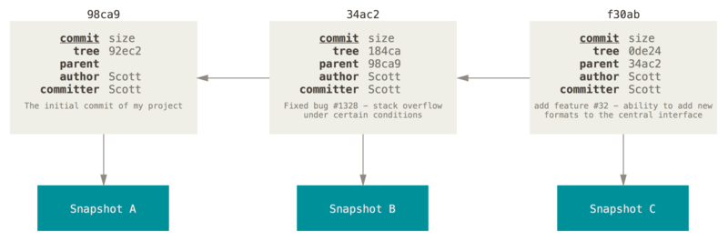

# Git分支

## 1. 分支简介

使用分支后可以把工作从开发主线上分离开来，以免影响开发主线。

Git处理分支的方式非常轻量，创建新分支这一操作几乎能在瞬间完成，并且在不同分支之间的切换操作也是一样便捷。Git鼓励在工作流程中频繁地使用分支与合并。

 Git保存的不是文件的变化或者差异，而是一系列不同时刻的**快照** 。在进行提交操作时，Git会保存一个**提交对象（commit object）**，该提交对象会包含一个指向暂存内容快照的**指针**，该提交对象还包含了作者的姓名和邮箱、提交时输入的信息以及指向它的父对象的指针。 首次提交产生的提交对象没有父对象，普通提交操作产生的提交对象有一个父对象， 而由多个分支合并产生的提交对象有多个父对象。

### 1.1 简介

假设现在有一个工作目录，里面包含了三个将要被暂存和提交的文件。 暂存操作会为每一个文件计算校验和（使用SHA-1哈希算法），然后会把当前版本的文件快照保存到Git仓库中（Git使用*blob*对象来保存它们），最终将校验和加入到暂存区域等待提交：

```bash
$ git add README test.rb LICENSE
$ git commit -m 'The initial commit of my project'
```

当使用`git commit`进行提交操作时，Git会先计算每一个子目录的校验和， 然后在Git仓库中这些校验和保存为树对象。随后Git便会创建一个提交对象， 它除了包含上面提到的那些信息外，还包含指向这个树对象（项目根目录）的指针。 如此一来，Git就可以在需要的时候重现此次保存的快照。

现在，Git仓库中有五个对象：三个*blob*对象（保存着文件快照）、一个**树**对象（记录着目录结构和blob对象索引）以及一个**提交**对象（包含着指向前述树对象的指针和所有提交信息）。

<left></left>

除第一次提交，后面产生的提交对象会包含一个指向上次提交对象的指针：

<left></left>

Git的分支，其实本质上仅仅是指向提交对象的可变指针。 

<left></left>

### 1.2 创建分支

Git创建新分支的时候只是创建了一个可以移动的新的指针。

使用`git branch`命令来创建新的分支：

```bash
$ git branch testing
```

这会在当前所在的提交对象上创建一个指针：

<left></left>

Git是怎么知道当前在哪一个分支上的呢，它有一个名为`HEAD`的特殊指针指向当前所在的本地分支。`git branch`命令仅仅**创建**一个新分支，并不会自动切换到新分支中去，所以`HEAD`指针的指向不会变化。

<left></left>

### 1.3 切换分支

要切换到一个已存在的分支，需要使用`git checkout`命令，比如切换到testing分支：

```bash
git checkout testing
```

切换分支后`HEAD`指针会指向`testing`分支。

<left></left>

在当前`testing`分支上进行修改，分支会随着提交操作自动向前移动：

```bash
$ vim test.rb
$ git commit -a -m 'made a change'
```

<left></left>

切换回master分支，HEAD会跟着移动回master分支：

```bash
$ git checkout master
```

<left></left>

这条命令做了两件事：一是使HEAD指回 `master` 分支，二是将工作目录恢复成 `master` 分支所指向的快照内容。 如果现在做修改，项目将始于一个较旧的版本。 本质上来讲，这就是忽略了 `testing` 分支所做的修改，以便于向另一个方向进行开发。

如果继续在master分支上进行修改，项目的提交历史将产生分叉：

```bash
$ vim test.rb
$ git commit -a -m 'made other changes'
```

<left></left>

由于Git的分支实质上仅是包含所指对象校验和的文件，所以它的创建和销毁都异常高效。 

在创建一个新分支后并立即切换过去，可以使用快捷命令：

```bash
$ git checkout -b <new branch name>
```

## 2. 分支的新建与合并

### 2.1 新建分支

为了解决某个问题，从master新建一个分支并切换到那个分支上：

```bash
$ git checkout -b iss53
Switched to a new branch 'iss53'
```

<left></left>

在iss53分支上进行提交：

<left></left>

如果此时有一些紧急问题需要处理，就需要切换回master分支，然后创建一个新的分支来完成这些紧急处理。但是在这么做之前，要留意工作目录和暂存区里那些还没有被提交的修改， 它可能会和即将检出的分支产生冲突从而阻止Git切换到该分支。 最好的方法是在切换分支之前保持好一个干净的状态（可以使用暂存（stashing）和修补提交（commit amending）来解决这个问题）。

切换回master分支并新建分支：

```bash
$ git checkout master
Switched to branch 'master'
$ git checkout -b hotfix
Switched to a new branch 'hotfix'
$ echo "hotfix code" > hotfix.txt
$ git add *
$ git commit -m "hotfix分支的第一次提交"
```

<left></left>


当hotfix处理完所有问题之后，可以将hotfix分支合并回master分支：

```bash
$ git checkout master
$ git merge hotfix
```

<left></left>

由于想要合并的分支`hotfix`所指向的提交`C4`是所在提交`C2`的直接后继，因此Git会直接将指针向前移动。换句话说，当试图合并两个分支时，如果顺着一个分支走下去能够到达另一个分支，那么Git在合并两者的时候，只会简单的将指针向前推进（指针右移），因为这种情况下的合并操作没有需要解决的分歧——这就叫做**快进（fast-forward）**。

删除hotfix分支：

```bash
$ git branch -d hotfix
```

切换回iss53分支继续进行之前的工作：

<left></left>

### 2.2 合并分支

当在iss53分支上完成了当前工作后，就可以将iss53分支合并到master分支了：

```bash
$ git checkout master
$ git merge iss53
```

这和之前合并`hotfix`分支的时候看起来有一点不一样。 在这种情况下，开发历史从一个更早的地方开始分叉开来（diverged）。 因为`master`分支所在提交并不是 `iss53` 分支所在提交的直接祖先，Git不得不做一些额外的工作。 出现这种情况的时候，Git会使用两个分支的末端所指的快照（`C4` 和 `C5`）以及这两个分支的公共祖先（`C2`），做一个简单的三方合并。

<left></left>

和之前将分支指针向前推进所不同的是，Git将此次三方合并的结果做了一个新的快照并且自动创建一个新的提交指向它。 这个被称作一次合并提交，它的特别之处在于他有不止一个父提交。

<left></left>

删除iss53分支：

```bash
$ git branch -d iss53
```

### 2.3 遇到冲突时的分支合并

 如果在两个不同的分支中对同一个文件的同一个部分进行了不同的修改，Git就没法正常的合并它们。此时 Git 做了合并，但是没有自动地创建一个新的合并提交。 Git 会暂停下来，等待你去解决合并产生的冲突。  

查看有冲突的文件的状态：

```bash
$ git status
On branch master
You have unmerged paths.
  (fix conflicts and run "git commit")
  (use "git merge --abort" to abort the merge)

Unmerged paths:
  (use "git add <file>..." to mark resolution)
        both modified:   README
```

任何因包含合并冲突而有待解决的文件，都会以未合并状态标识出来。Git会在有冲突的文件中加入标准的冲突解决标记，可以打开这些包含冲突的文件然后手动解决冲突。 出现冲突的文件会包含一些特殊区段：

```bash
<<<<<<< HEAD
master修改的地方
=======
iss53修改的地方
>>>>>>> iss53
```

`=======` 的上半部分表示当前分支修改的内容，`=======` 的下半部分表示被合并分支修改的内容。为了解决冲突，必须选择使用由 `=======` 分割的两部分中的一个，或者也可以自行合并这些内容。就比如修改成以下内容：

```bash
master修改的地方
iss53修改的地方
```

在解决冲突时需要删除`<<<<<<<`，`=======`，和`>>>>>>>`这些标签，一旦暂存这些原本有冲突的文件，Git就会将它们标记为冲突已解决。

## 3. 分支管理

### 3.1 查看当前所有分支

```bash
$ git branch
  iss53
* master
```

注意`master`分支前的`*`字符：它代表现在检出的那一个分支，也就是当前`HEAD`指针所指向的分支。 这意味着如果在这时候提交，`master`分支将会随着新的工作向前移动。

### 3.2 查看每一个分支的最后一次提交

```bash
$ git branch -v
  iss53  54ceffa iss53提交“
* master f7d0ab4 解决冲突
```

### 3.3 查看哪些分支已经合并到当前分支

```bash
$ git branch --merged
  iss53
* master
```

在这个列表中分支名字前没有`*`号的分支通常可以删除掉，因为已经将它们的工作整合到了另一个分支，所以并不会失去任何东西。

### 3.4 查看所有包含未合并工作的分支

```bash
$ git branch --no-merged 
  iss53
```

如果删除包含未合并工作的分支，就将报错：

```bash
$ git branch -d iss53
error: The branch 'iss53' is not fully merged.
If you are sure you want to delete it, run 'git branch -D iss53'.
```

可以使用`git branch -D iss53`来强制删除一个分支。

在使用选项`--merged`和`--no-merged`时如果没有指定特定的分支，则默认是基于当前分支的。可以提供一个附加的参数来查看其它分支的合并状态而不必检出它们：

```bash
$ git branch --no-merged iss53
```

## 4. 分支开发工作流

## 5. 远程分支

## 6. 变基

## 7. 总结